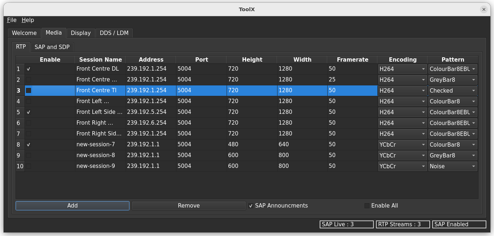

[](https://github.com/DefenceX/MediaX/actions/workflows/build-ubuntu-20.04-amd64.yaml)
[](https://github.com/DefenceX/MediaX/actions/workflows/build-ubuntu-22.04-amd64.yaml)
[](https://sonarcloud.io/project/overview?id=DefenceX_MediaX)


[](https://sonarcloud.io/summary/new_code?id=DefenceX_MediaX)
[](https://sonarcloud.io/summary/new_code?id=DefenceX_MediaX)
[](https://sonarcloud.io/summary/new_code?id=DefenceX_MediaX)
[](https://sonarcloud.io/summary/new_code?id=DefenceX_MediaX)
[](https://sonarcloud.io/summary/new_code?id=DefenceX_MediaX)
[](https://sonarcloud.io/summary/new_code?id=DefenceX_MediaX)

# Real Time Protocol in C++

<a rel="license" href="http://creativecommons.org/licenses/by-nc/4.0/"></a><br />This work is licensed under a <a rel="license" href="http://creativecommons.org/licenses/by-nc/4.0/">Creative Commons Attribution-NonCommercial 4.0 International License</a>.

This library (compliant to ISO/IEC 14882 C++17) implements [RFC 4421](https://datatracker.ietf.org/doc/html/rfc4421) RTP (Real Time Protocol) Payload Format for Uncompressed Video and [RFC 3984](https://datatracker.ietf.org/doc/html/rfc3984) for H.264 video as mandated by the UK MoD as part of DEF STAN 00-082 (VIVOE) uncompressed RTP video streaming protocol for real time video. If you are not familiar with the Generic Vehicle Architecture (DEF STAN 00-23) and VIVOE then you can read more [here](https://en.wikipedia.org/wiki/Generic_Vehicle_Architecture).

Transmit streams emit a SAP/SDP announcement every second as per RFC 2974 and RFC 4566. Also referenced as in DEF STAN 00-082. Below is an example of how to stream video using the C++17 template class.

``` .cpp
#include "rtp/rtp.h"
int main(int argc, char *argv[]) {
  mediax::RtpSapTransmit<mediax::rtp::uncompressed::RtpUncompressedPayloader> rtp(
      "238.192.1.1", 5004, "test-session-name", 640, 480, 30, "RGB24");
  std::vector<uint8_t> &data = rtp.GetBufferTestPattern();
  for (int count = 0; count < 1000; count++) rtp.Transmit(data.data(), false);
}
```

To use another RTP payloader just change the template class i.e. To switch to H.264 use:

``` .cpp
  mediax::RtpSapTransmit<mediax::rtp::h264::gst::vaapi::RtpH264GstVaapiPayloader> rtp(
      "238.192.1.2", 5004, "test-session-name-compressed", 640, 480, 30, "H264");
```

## Python bindings

Library has Python bindings for video streaming (and SAP/SDP support) with AI frameworks and use inside Jypter notebooks.

Once built and installed import as follows:

``` .py
import sys
sys.path.append('/usr/local/lib/python3/dist-packages/mediax')

import sap_listener
import sap_announcer
import rtpvraw_payloader
import rtpvraw_depayloader
```

# Qt6 bindings

These bindings are production ready and underpin our GUI toolchain. Please find documentation [here](https://defencex.github.io/MediaX/namespacemediax_1_1qt.html) and code examples [here](https://defencex.github.io/MediaX/index.html#qtcode)

To build from source add with Qt6 add:

```
cmake -DBUILD_QT6=ON ..
```

# Generic Vehicle Architecture

All modes supported as defined in DEF-STAN 00-082 (uncompressed, MJPEG and H.264)

# Generic Soldier Architecture

Currently in draft, MediaX supports for H.265 and AV1 (requires rust gstreamer plugins) encoders.

 > NOTE: You must install the code to enable the Rust gstreamer AV1 RTP element after building
## Documentation

Doxygen documentation is available on [Github Page](https://defencex.github.io/MediaX).

## Licensing and Commercial support

<a rel="license" href="http://creativecommons.org/licenses/by-nc/4.0/"></a><br />This work is licensed under a <a rel="license" href="http://creativecommons.org/licenses/by-nc/4.0/">Creative Commons Attribution-NonCommercial 4.0 International License</a>.

This library is also available as part of VivoeX Pro under a commercial license. This version of the library supports all colour spaces listed in DEF STAN 00-082 and RTP H.264 hardware acceleration when run on Intel and Nvidia hardware. Please visit <http://defencex.ai> for more information and support.

Commercial version also comes with GUI tools for debugging of video streams


