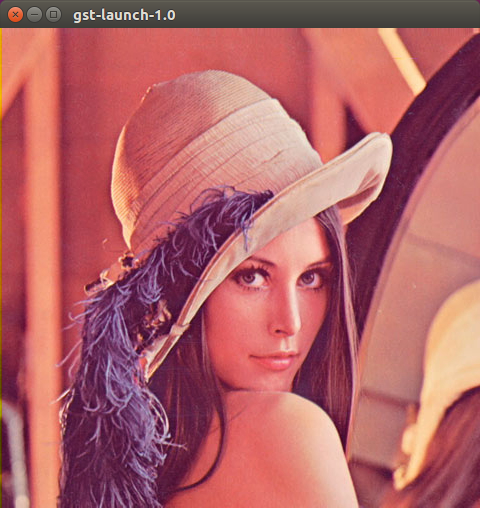

[](https://opensource.org/licenses/MIT)
# Real Time Protocol in C
This code implements RFC4421 RTP (Real Time Protocol) Payload Format for Uncompressed Video but is mandated by the UK MoD as part of DEF STAN 00-82 (VIVOE) uncompressed RTP video straming protocol for real time video. If you are not familiar with the Generic Vehicle Architecture (DEF STAN 00-23) and VIVOE then you can read more [here](https://en.wikipedia.org/wiki/Generic_Vehicle_Architecture).

## Payloader example
This is a RAW (YUV) Real Time Protocol pay-loader written in C. This example is send only to recieve the data you can use the gstreamer pipeline below.

> **NOTE** : This example has been tested on 64 bit ARM. Target hardware was the Nvidia Jetson TX1/TX2 and Abaco Systems GVC1000. Code is endian swapped. To run on intel set #define ARM  0 in [rtpstream.c](rtpstream.c). If you see jitter then modify rc.local as per [rc.local](tx1/rc.local)

#Dependancies
The following dependancies need to me installed prior to building this project:
```
sudo apt install libswscale
```
libswscale is required for RGB/RGBA to UYVY colourspace conversion.
# Installation
Build the example
```
mkdir build
cmake ..
```
Run the example
```
./rtp-example
```
Catch the stream using the gstreamer src pipeline in the section below.

> **NOTE** : This example uses the test image ([lena-lg.png](lena-lg.png)) as the source of the video stream. You can replace lena with your own image or use another source for the video data.

## gstreamer YUV streaming examples
The test script test02.sh runs the example program against gstreamer.

Use this pipeline as a test payloader to make sure gstreamer is working:

    gst-launch-1.0 videotestsrc ! video/x-raw, format=UYVY, framerate=25/1, width=640, height=480 ! queue ! rtpvrawpay ! udpsink host=127.0.0.1 port=5004

Use this pipeline to capture the stream:

    gst-launch-1.0 -v udpsrc port=5004 caps="application/x-rtp, media=(string)video, clock-rate=(int)90000, encoding-name=(string)RAW, sampling=(string)YCbCr-4:2:2, depth=(string)8, width=(string)480, height=(string)480, payload=(int)96" ! queue ! rtpvrawdepay ! queue ! videoconvert ! ximagesink 
    
Gstreamer running with test image [lena-lg.png](lena-lg.png) (480x480):


